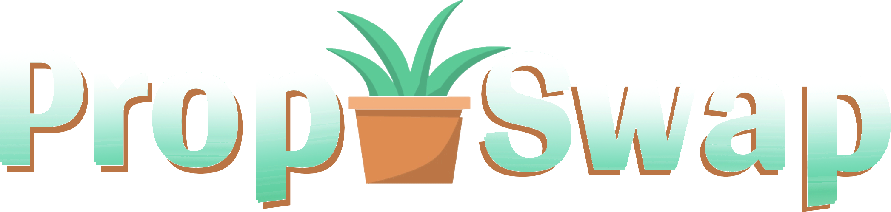
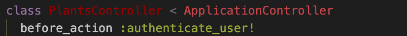
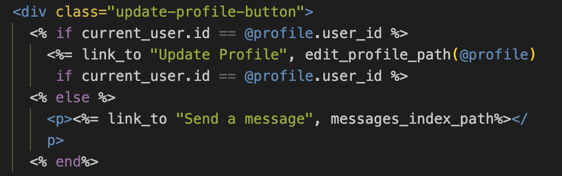
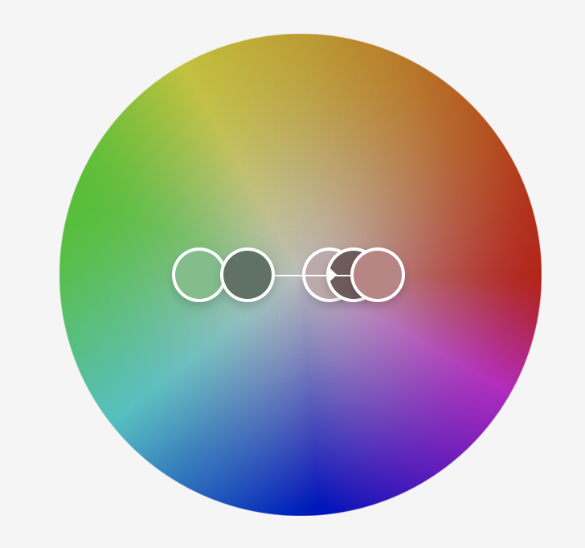
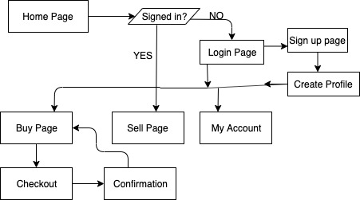
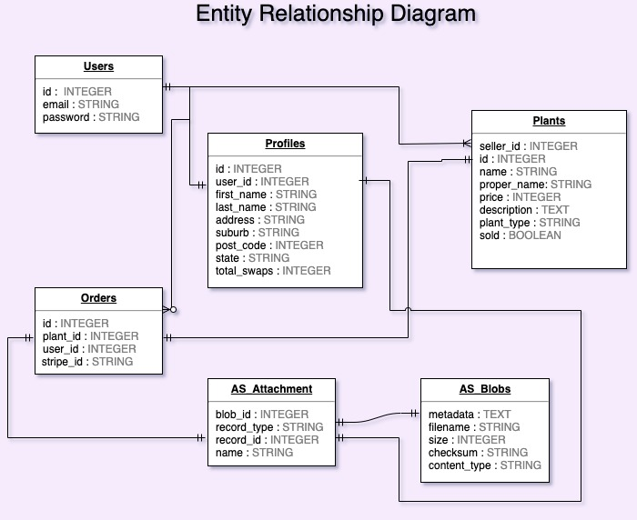
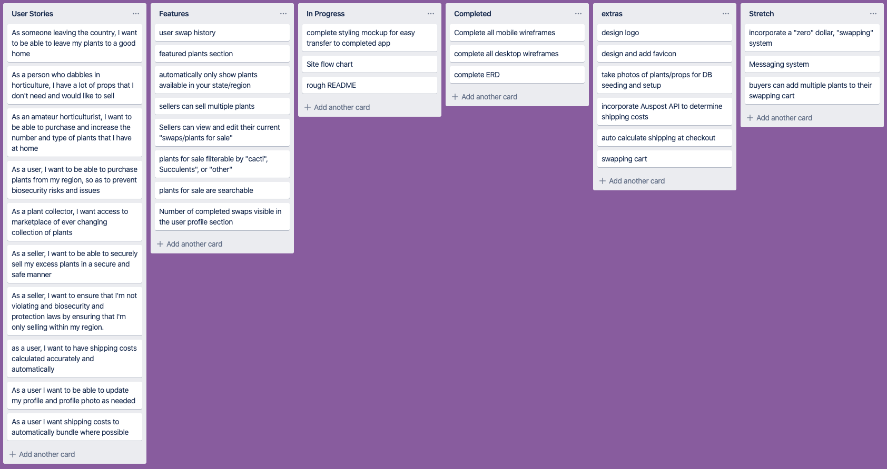
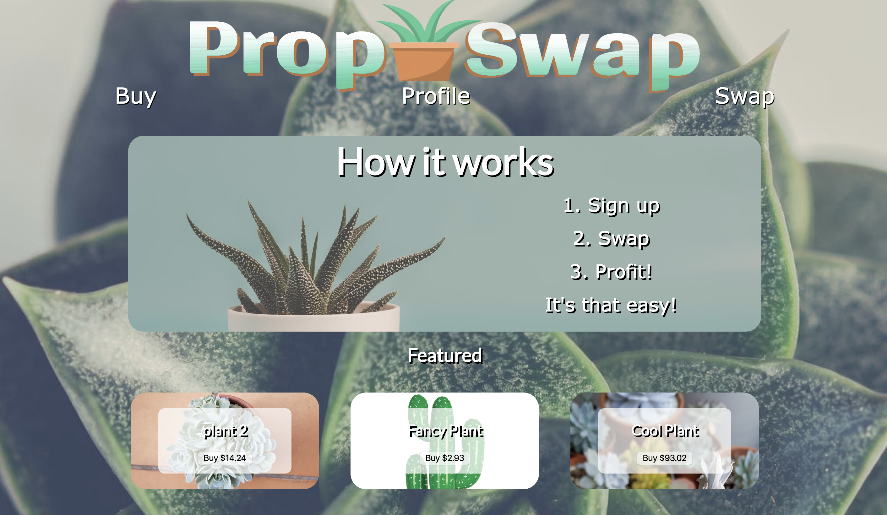
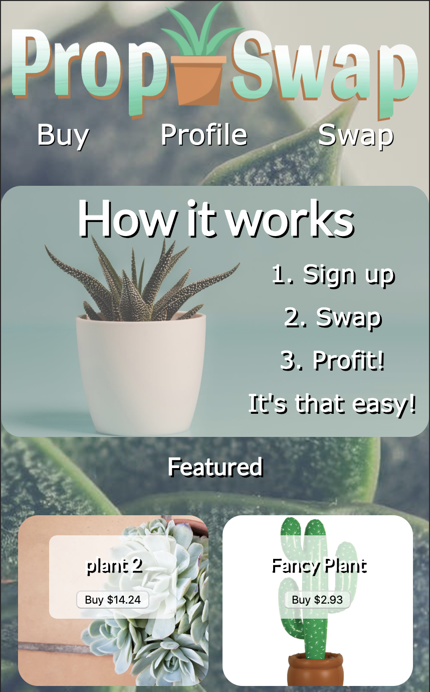

<h1><strong>PropSwap Shop</strong></h1>

<h5>Dale Thompson</h5>

Completed for Coderacademy - November 2019

Github: <a href="https://github.com/DBThompson713/prop_swap_shop">PropSwap on Github (R10)</a>

Live Site: <a href="#">Deployed to Heroku (R9)</a>

<h3><strong>Purpose - (R7 & R8)</strong></h3>

In the Australian market, there is not currently a dedicated online  marketplace for individuals to buy and sell plants, props and plant cuttings. Other marketplaces do exist which potentially include this functionality, however since they do not specifically cater to this market, generally speaking budding horticulturalists are often hesitant to utilize existing marketplaces.

If a person wants to sell or buy plants online, barring setting up an online store, the only options are gumtree or ebay. Neither of which are set up to handle the specific intricacies of shipping and handling plants. Furthermore, with gumtree, you never know who you are dealing with, the quality of the product, and lastly there is no easy recourse for correction in the event that something goes wrong

Propswap will fill the gap which currently exists in the niche market of plant, prop and cutting - user to user sales.

The idea is to simplify the purchasing and selling of plants while simultaneously ensuring the safety of the plants themselves, as well as the protection of the environment and enforcement biosecurity laws.

<!-- POTENTIAL ISSUES AND SOLUTIONS -->

 
<h5>Potential issues - Possible solutions</h5>
<ol>
<li><strong>Australia has strict bio-protection laws - even between states</strong></li>
<ul>
<li>Only allowing users and only showing plants which are currently for sale in New South Wales and Victoria ensures that there are no biosecurity laws being broken, as well as ensures that most of the Australian population is still able to acces the site.</li>
</ul>

<li><strong>Plants are not able to survive long trips in boxes</strong></li>
<ul>
<li>By limiting the buyers to plants located in their state, it should minimise the travel time between buyer and seller.
</li>
<li>Only allowing express shipping will help ensure that plants arrive alive.
</li>
</ul>
</ul>

<li><strong>Shipping costs and methods should be standardised</strong></li>
<ul>
<li>As a stretch goal, incorporating an Auspost API to calculate the shipping for each sale as well as forcing only express shipping will ensure that costs and methods are standardised. It will also ensure that sellers are not "ripping off" buyers through exorbitant shipping costs.</li>
</ul>

</ol>

<!-- BASIC SITE INFORMATION -- TECH STACK, SITE MAP, TRELLO BOARD, ERD, WIREFRAMES -->

<h3><strong>Tech stack</strong></h3>
<ul>
 <li>Ruby on Rails</li>
 <li>HTML && CSS</li>
 <li>Amazon AWS S3</li>
 <li>Stripe</li>
 <li>Devise</li>
</ul>

<h3><strong>Third Party Gems used (R16)</strong></h3>
<ul>
 <li>Stripe</li>
 <li>Devise</li>
 <li>Amazon AWS S3</li>
 <li>Normalize-rails</li>
 <li>Devise</li>
</ul>

<h1>Features</h1>

<ul>
<li><strong>Ability to purchase plants</strong></li>

Purchasing and the ability to pay is handled directly nd completely through stripe.

<li><strong>User Authentication</strong></li>

User authentication is handled through devise.

In order to access any page, with the exception of the home page, the user will be required to sign in.

The above line included in the appropriate controllers,(plants,profiles) ensures that the user is logged in before being able to nearly anything on the site

<li><strong>User Authorisation</strong></li>

User authentication is handled through devise.

A logged in user is able to edit their own "Swaps" in which they've created. A user cannot edit another user's swaps.

A user is also able to edit/update their own user profile, but not able to edit another user's profile. The update profile button changes to a send a message button for a profile which does not belong to the current user.

The above code shows how a user is unable to even see the update profile button, unless they are signed in as the user that owns that profile. If they are not the proper user, they will instead see a link to send a message to the user, which unfortunately in this version of the site is not implemented.

<li><strong>Full Responsive design</strong></li>

This site was designed to be fully functioning on either a desktop or mobile browser. The style and design are fully translatable with very little responsive css required. The use of flex display throughout the site made for an easy transition to mobile and back.

On the desktop version of the home page the featured "swaps" displays 3 plants, however on the mobile version that number is limited to 2 featured swaps, due to space limitations.

<h2>Features planned, but not implemented</h2>
<li><strong>Messaging</strong></li>
<ul>
<li>
This feature was partially implemented, however I was never able to get it to work quite the way I wanted, so in the end I left the feature half completed, but unaccessable through standard usage of the site. 
</li>
<li>
I hope to continue working to get this featuring up and running
</li>
</ul>
<li><strong>Implementation of the AusPost API to calculate shipping</strong></li>
<ul>
<li>
Due to time constraints I was unable to get this feature included in this version of the site. I hope to implement it in the future.
</li>

</ul>

</ul>

<h3><strong>Colour and theme</strong></h3>

The initial idea was to keep the background either white or a neutral colour and then use colours which are somewhat natural and neutral, the inital colour scheme was based on the following:

As I worked on the project I decided to change the background to an image of a succulent to introduce a little colour to the page as a whole. My thought process was that since the rest of the elements are pretty clean, setting those elements on a white or wholly neutral background would lead to the elements being washed out somewhat.

I looked at other two way marketplaces as well as at pinterest to get some ideas, however in the end, I did what I usually end up doing and disregarded much of that in favour of just having a go and seeing what I could come up with.

<h3><strong>Wireframes (R13)</strong></h3>

<h3><strong>Site map</strong></h3>

It's not pretty, but this is the site map for prop swap.

<h3><strong>Database Entity Relationship Diagram (ERD) (R14)</strong></h3>

 The actual database ended up with 2 additional tables for messages and conversations as part of the plan to implement messaging between users. The databases have been left in place to allow for the future implementation of this feature.
 

<h3><strong>Trello Board</strong></h3>

<h3><strong>Rails Models</strong></h3>

<h3><strong>User Stories (R12)</strong></h3>
<ul>
<li>As a person who dabbles in horticulture, I have a lot of props that I don't need and would like to sell</li>
<li>As an amateur horticulturist, I want to be able to purchase and increase the number and type of plants that I have at home</li>
<li>As a user, I want to be able to purchase plants from my region, so as to prevent biosecurity risks and issues</li>
<li>As a plant collector, I want access to marketplace of ever changing collection of plants</li>
<li>As a user I want to be able to update my profile and profile photo as needed</li>
<li>As a seller, I want to be able to securely sell my excess plants in a secure and safe manner</li>
<li>As a buyer, I want to be able to see the plants I'm going to purchase, as well as get some basic information to ensure that the plant is what I require.</li>

</ul>

<h3><strong>Model (R17)</strong></h3>

Prop Swap makes use of the following models

<ul>
<li></li>
<li></li>
<li></li>
<li></li>
<li></li>

</ul>

User
Profile
Crawl
Location
Review
Attendee

<h3><strong>R15	Explain the different high-level components (abstractions) in your app</strong></h3>

<h1>Final product Screencaps</h1>

The desktop and mobile sites are extremely similar in design as illustrated with the below landing page.

For the sake of brevity, I'll be displaying only the desktop below, home page excluded.

